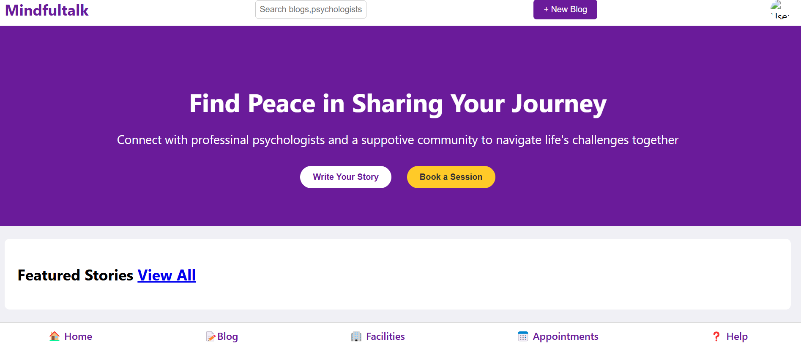

# MENTAL HEALTH

## TECHNOLOGIES USED.
*Css
*JavaScript
*Html
### FUNCTIONS OF MENTAL HEALTH WEBSITE.
*Mental Health Website was created to spread Mental awarness and help people who are struggle with mental health.
*On the website you are able to share your exprience and encourage other people who are struggling with the same problem.
*If your struggling with a certain problem like Depression,Anxiety,Trauma e.t.c ,your able to find stories shared by other people on the same topic.
*Mental health website has a section called facilities, this is where you are able to get a map of your area and get see a nearby health center that can help you.
*the website also allows you to book appointments for visiting the facilities.
*You may know of a facility by you need argent help,that is why i thought it was important to have helplines on the website that hundle different situation like a help line specificaly for substance abuse but that is one of many that are on the app including a national Suicide Lifeline emergency number.Considering the rising number of suicide rate in the world.

#### REASONS FOR CREATING A MEANTAL HEALTH WEBSITE.
*To spread awareness about mental health.
*To reduce the number of suicide deaths around the word.
*To provide access to help.
*This app can encourage people to speak up about mental struggles.
*This can help a person recognise a problem before it gets worse.
*Sometimes one knows what they are suffering from but do not knnow how to address it because they do not have the money to visit a facility or a doctor but with this website they are able to get assistance for free.

##### STEPS ON HOW I CREATED THIS APP.
*i brainstormed on the topic l wanted to cover.
*i choose what building method l wanted to use and l choose HTML,CSS,JavaScript and Booststrap.
*i had to understand what would each section cover.
Home-intro,mission.
Blog- community stories.
Facilities-google map.
Appointment-where one can book an appointment with a doctor.
Help-Emergency calls.
*Just like the rest i used Git hub to get a link for my website.
*i had to text if all the links were working and if there were any bugs.

